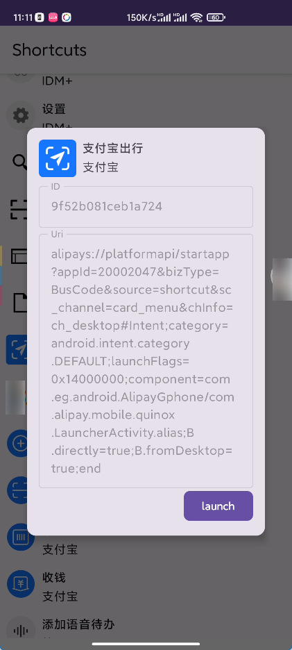

# Android Shortcut Helper

Android 快捷方式助手。

## 功能

获取系统中注册的所有应用的 shortcuts (快捷方式) ，以及它们的 intent —— 包括桌面快捷方式、长按桌面应用图标的快捷方式等。

> 具体可参见[应用快捷方式概览](https://developer.android.com/guide/topics/ui/shortcuts?hl=zh-cn)

你可以直接获得快捷方式的 intent URI （包括所有的 extras）。

> 快捷方式的 extras 被限制为基本类型（`PersistenceBundle` 支持的类型）

弹出的 Dialog 中可以点击复制 uri 或点击下面的 launch 启动这个 intent 。  
应用也可以发起 `Intent.CREATE_SHORTCUT` 的 Intent 来选择一个快捷方式
（如 [Anywhere](https://github.com/zhaobozhen/Anywhere-) 或 [FV 悬浮球](https://play.google.com/store/apps/details?id=com.fooview.android.fooview&hl=zh&gl=US)）。  

## 原理

1. ShortcutInfo 的获取

由于系统 API 的限制，通过 `LauncherApps` 或者 `ShortcutService` 获取的 shortcuts 都会被剔除部分信息，导致无法获得 intent 。   
因此目前通过解析目录 `/data/system_ce/0/shortcut_services` 下的 xml 获取 ShortcutInfo 。

2. 图标的获取

参考了 `LauncherApps` 的实现。

## 注意

1. 目前需要 root 权限（存在 shell 权限的方案，即解析 `dumpsys shortcut` ）。  
2. 需要特殊权限的 Intent 暂时无法在 App 内启动。  
3. 目前仅支持解析主用户的 shortcut 。  
4. 有概率出现获取不完全的情况，此时可以尝试刷新。  
5. 目前 `CREATE_SHORTCUT` 返回的快捷方式不含图标。  
6. ~~UI 真的很烂，期待 UI 大师指点~~  

## TODO

1. 支持 shell 权限（计划使用 Shizuku API）  
2. 更好的 UI  
